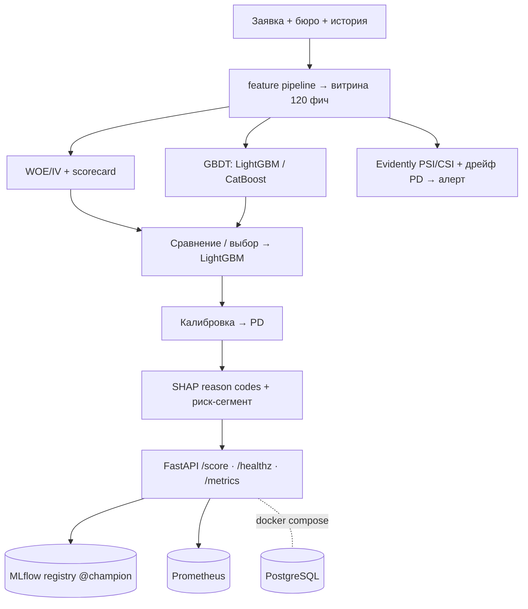

# Credit Scoring (PD) as a Service · v1.0.0

[](https://github.com/dataeclipse/bank-credit-scoring/actions/workflows/ci.yml)


Production-сервис оценки **вероятности дефолта (PD)** по кредитной заявке: REST-эндпоинт принимает
заявку → возвращает PD, скоринговый балл, риск-сегмент и **топ-причины решения** (reason codes).
Не «ещё один XGBoost на Home Credit», а то, что банк требует от рисковой модели: **WOE/scorecard рядом
с GBDT**, **калибровка вероятностей**, **fairness-анализ**, **мониторинг дрейфа (PSI/CSI)**,
**model card** в духе НБРК/SR 11-7 — и всё это в Docker одной командой.

> Бейдж CI активируется после пуша в GitHub (замени `dataeclipse/bank-credit-scoring` на свой repo).

## Problem
Команда кредитных рисков оценивает PD по заявке для решения о выдаче. Нужна не просто точная модель,
а **защищаемая на валидации**: интерпретируемая (scorecard + reason codes), с корректной вероятностью
(калибровка), проверенная на справедливость (fairness), с мониторингом стабильности (PSI/CSI) и
воспроизводимым деплоем. Этот проект закрывает весь контур.

## Data
**Home Credit Default Risk** (Kaggle) — анонимизированные данные потребкредитования: заявки, история
бюро, прошлые кредиты, платежи, баланс карт. `data/` в `.gitignore`. Загрузка — `make download`
(Kaggle API; нужны `KAGGLE_USERNAME`/`KAGGLE_KEY` в `.env` + принятые правила соревнования).

## Architecture


## Quickstart — `docker compose up`
Из каталога `01-credit-scoring-pd/`. Нужна обученная модель (см. ниже), затем:
```bash
make export-model        # запечь pd-lightgbm@champion → deploy/model/ (joblib)
docker compose -f infra/compose.yaml up --build      # api + postgres
curl http://localhost:8000/healthz
curl -X POST http://localhost:8000/score -H 'Content-Type: application/json' -d '{
  "AMT_INCOME_TOTAL": 135000, "AMT_CREDIT": 600000, "DAYS_BIRTH": -14000,
  "CODE_GENDER": "M", "EXT_SOURCE_1": 0.12, "EXT_SOURCE_2": 0.18, "EXT_SOURCE_3": 0.15 }'
```
MLflow UI (опц.): `docker compose -f infra/compose.yaml --profile tools up`.

**Полный путь с нуля** (нужны Kaggle-креды + `uv`):
```bash
make install-ml                       # uv sync --extra ml
make download && make features        # данные → витрина (data/ в .gitignore)
make train                            # 3 модели → MLflow registry (pd-scoring-train)
make export-model && docker compose -f infra/compose.yaml up --build
```
Dev-команды: `make lint` · `make type` · `make test` · `make run` (uvicorn локально). Нет `make` на
Windows — вызывай `uv run …` напрямую.

## Results
**Витрина**: 356 255 клиентов × 120 фич; дефолтов **8.07%** (~1:11). EDA: [docs/eda.md](docs/eda.md).

**Модели** (holdout 61 503, stratified seed 42; всё в MLflow):

| Модель | ROC-AUC | PR-AUC | KS | Gini |
|---|---|---|---|---|
| Scorecard (WOE, 76/120 фич) | 0.770 | 0.255 | 0.407 | 0.539 |
| **LightGBM (прод)** | **0.790** | 0.287 | **0.440** | **0.579** |
| CatBoost | 0.789 | 0.289 | 0.440 | 0.579 |

→ **в прод LightGBM** (Gini 0.579); scorecard — интерпретируемый challenger.
[comparison](docs/model_comparison.md) · [selection](docs/model_selection.md).

**Калибровка**: LightGBM уже откалиброван — Brier 0.066, **ECE 0.0028** (<0.01). [calibration.md](docs/calibration.md).
**Объяснимость**: reason codes «за/против» по заявке. **Fairness**: пол DI 0.82, возраст DI 0.63
(<0.8 — молодые в зоне риска). [explainability](docs/explainability.md) · [fairness](docs/fairness.md).

### Пример `/score` (высокий риск)
```json
{"pd": 0.532, "score": 309, "segment": "high",
 "reason_codes": [
   {"feature": "EXT_SOURCE_3", "direction": "increases",
    "description": "внешний скоринговый балл (источник 3) = 0.1 — повышает риск"},
   {"feature": "DAYS_BIRTH", "direction": "decreases",
    "description": "возраст в днях (<0) = -8500 — снижает риск"}],
 "model_version": "3"}
```
Контракт + второй пример (low-risk): [docs/serving.md](docs/serving.md). Латентность /score: p50 ≈ 83 мс
(бюджет в [load_test.md](docs/load_test.md)).

## Мониторинг дрейфа
PSI/CSI входов + дрейф PD; алерт при **PSI > 0.2**. Демонстрация: `pd-scoring-drift --demo-drift` ловит
подмену распределения. [docs/monitoring.md](docs/monitoring.md).

## Model card
[docs/model_card.md](docs/model_card.md) — назначение/scope, данные и ограничения, метрики, калибровка,
объяснимость, fairness, ограничения, мониторинг, governance/версионирование (НБРК / SR 11-7 / Basel).

## Ограничения
Demo/портфолио (не боевое решение): прокси-группы анонимны; **reject inference** не делался
(survivorship bias); **age-bias** (DI 0.63); на serving агрегаты истории = null (быстрый путь по данным
заявки). Перед прод — независимая валидация модели.

## Deploy
Короткая инструкция (Fly.io / VPS): [docs/deploy.md](docs/deploy.md).

## Roadmap
| Фаза | Содержание |
|---|---|
| 0 ✅ | Скелет: структура, uv/pyproject, ruff/mypy/pytest/pre-commit, CI, `/healthz` |
| 1 ✅ | Данные и витрина фичей (Home Credit, агрегации без утечек, EDA, split+seed) |
| 2 ✅ | Две модели: WOE-scorecard + GBDT, метрики, MLflow, выбор в прод (LightGBM, Gini 0.579) |
| 3 ✅ | Калибровка (ECE 0.003) + SHAP reason codes + fairness (Fairlearn) |
| 4 ✅ | Сервис `/score` + Evidently PSI/CSI дрейф + нагрузочный тест (p50 83мс) |
| 5 ✅ | Docker/compose + CI/CD (build образа) + финальная model card + README |

## License
[MIT](../LICENSE).
