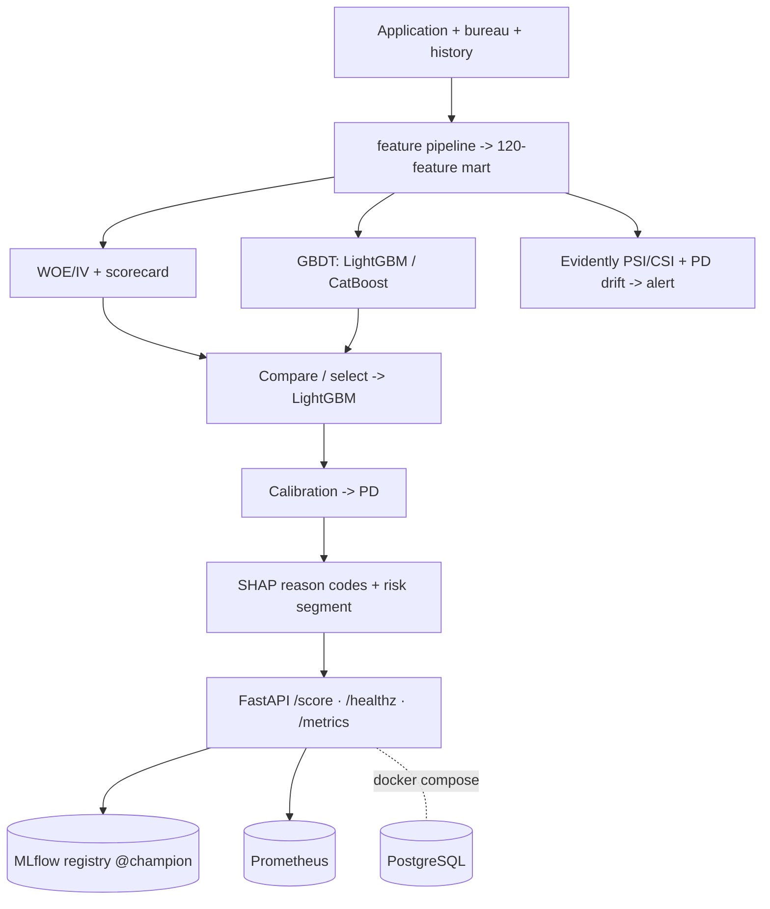

# Credit Scoring (PD) as a Service · v1.0.0

[](https://github.com/dataeclipse/bank-credit-scoring/actions/workflows/ci.yml)


A REST service that estimates the probability of default (PD) on a loan application. A request
goes in; the response carries the PD, a scorecard-style score, a risk segment, and the top
reasons behind the decision (reason codes). Around the model it also covers what a bank's model
validation asks for: a WOE scorecard next to a gradient-boosted model, probability calibration,
a fairness check, drift monitoring (PSI/CSI), and a model card in the style of NBRK / SR 11-7 -
all runnable with one Docker command.

## Problem
A credit risk team scores PD on each application to decide whether to lend. The model has to be
not just accurate but defensible at validation: interpretable (scorecard plus reason codes),
well-calibrated, checked for fairness, monitored for stability over time (PSI/CSI), and
reproducible to deploy. This project covers that whole loop.

## Data
**Home Credit Default Risk** (Kaggle) - anonymized consumer-lending data: applications, bureau
history, prior loans, payments, card balances. `data/` is in `.gitignore`. Download with
`make download` (Kaggle API; needs `KAGGLE_USERNAME`/`KAGGLE_KEY` in `.env` and accepted
competition rules).

## Architecture


## Quickstart - `docker compose up`
From the `01-credit-scoring-pd/` directory. A trained model is required (see below), then:
```bash
make export-model        # bake pd-lightgbm@champion -> deploy/model/ (joblib)
docker compose -f infra/compose.yaml up --build      # api + postgres
curl http://localhost:8000/healthz
curl -X POST http://localhost:8000/score -H 'Content-Type: application/json' -d '{
  "AMT_INCOME_TOTAL": 135000, "AMT_CREDIT": 600000, "DAYS_BIRTH": -14000,
  "CODE_GENDER": "M", "EXT_SOURCE_1": 0.12, "EXT_SOURCE_2": 0.18, "EXT_SOURCE_3": 0.15 }'
```
MLflow UI (optional): `docker compose -f infra/compose.yaml --profile tools up`.

**Full path from scratch** (needs Kaggle credentials and `uv`):
```bash
make install-ml                       # uv sync --extra ml
make download && make features        # data -> mart (data/ in .gitignore)
make train                            # 3 models -> MLflow registry (pd-scoring-train)
make export-model && docker compose -f infra/compose.yaml up --build
```
Dev commands: `make lint` · `make type` · `make test` · `make run` (uvicorn locally). No `make`
on Windows - call `uv run ...` directly.

## Results
**Mart**: 356,255 clients × 120 features; 8.07% defaults (~1:11). EDA: [docs/eda.md](docs/eda.md).

**Models** (holdout 61,503, stratified seed 42; all in MLflow):

| Model | ROC-AUC | PR-AUC | KS | Gini |
|---|---|---|---|---|
| Scorecard (WOE, 76/120 features) | 0.770 | 0.255 | 0.407 | 0.539 |
| **LightGBM (prod)** | **0.790** | 0.287 | **0.440** | **0.579** |
| CatBoost | 0.789 | 0.289 | 0.440 | 0.579 |

LightGBM goes to production (Gini 0.579); the scorecard stays as an interpretable challenger.
[comparison](docs/model_comparison.md) · [selection](docs/model_selection.md).

**Calibration**: LightGBM is already well-calibrated - Brier 0.066, **ECE 0.0028** (<0.01).
[calibration.md](docs/calibration.md).
**Explainability**: per-application reason codes (for/against). **Fairness**: gender DI 0.82,
age DI 0.63 (<0.8 - younger applicants are at higher risk of rejection).
[explainability](docs/explainability.md) · [fairness](docs/fairness.md).

### `/score` example (high risk)
```json
{"pd": 0.532, "score": 309, "segment": "high",
 "reason_codes": [
   {"feature": "EXT_SOURCE_3", "direction": "increases",
    "description": "external score (source 3) = 0.1 - increases risk"},
   {"feature": "DAYS_BIRTH", "direction": "decreases",
    "description": "age in days (<0) = -8500 - decreases risk"}],
 "model_version": "3"}
```
Contract plus a second (low-risk) example: [docs/serving.md](docs/serving.md). `/score` latency:
p50 ~= 83 ms (budget in [load_test.md](docs/load_test.md)).

## Drift monitoring
PSI/CSI on inputs plus PD drift; alert at **PSI > 0.2**. Demo: `pd-scoring-drift --demo-drift`
catches a distribution shift. [docs/monitoring.md](docs/monitoring.md).

## Model card
[docs/model_card.md](docs/model_card.md) - purpose/scope, data and limitations, metrics,
calibration, explainability, fairness, limitations, monitoring, governance/versioning
(NBRK / SR 11-7 / Basel).

## Limitations
Demo/portfolio (not a live lending decision): proxy groups are anonymized; **reject inference**
was not done (survivorship bias); **age bias** (DI 0.63); at serving time history aggregates are
null (a fast path on application data only). Independent model validation is needed before
production.

## Deploy
Short guide (Fly.io / VPS): [docs/deploy.md](docs/deploy.md).

## Roadmap
| Phase | Content |
|---|---|
| 0 ✅ | Skeleton: structure, uv/pyproject, ruff/mypy/pytest/pre-commit, CI, `/healthz` |
| 1 ✅ | Data and feature mart (Home Credit, leak-free aggregates, EDA, split+seed) |
| 2 ✅ | Two models: WOE scorecard + GBDT, metrics, MLflow, production pick (LightGBM, Gini 0.579) |
| 3 ✅ | Calibration (ECE 0.003) + SHAP reason codes + fairness (Fairlearn) |
| 4 ✅ | `/score` service + Evidently PSI/CSI drift + load test (p50 83 ms) |
| 5 ✅ | Docker/compose + CI/CD (image build) + final model card + README |

## License
[MIT](../LICENSE).
