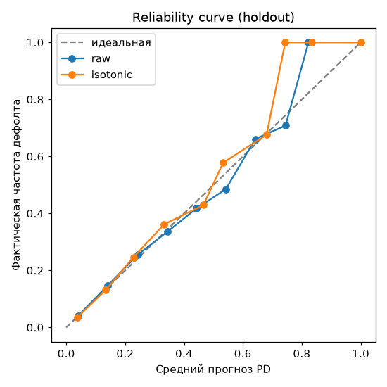

# Probability calibration (Phase 3)

Production model is LightGBM. The calibrator is trained on a separate calib set (from train),
evaluation is on holdout. No leakage: holdout is not seen by either the model or the calibrator.

## Brier / ECE on holdout (before and after)
| Variant | Brier ↓ | ECE ↓ |
|---|---|---|
| raw | 0.0657 | 0.0028 |
| isotonic | 0.0658 | 0.0042 |
| sigmoid | 0.0669 | 0.0148 |

The model is **already well calibrated** (raw ECE 0.0028 < 0.01): isotonic/Platt
do not reduce Brier/ECE. Production uses raw PD; the `isotonic` calibrator is kept as
a fallback (for example, in case of drift - Phase 4).

