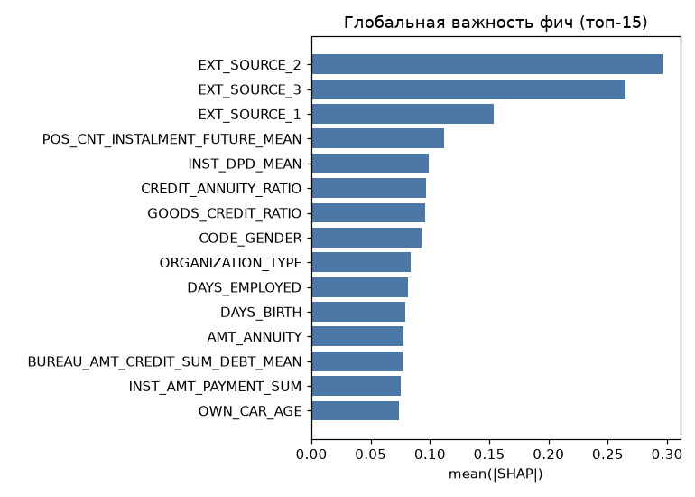
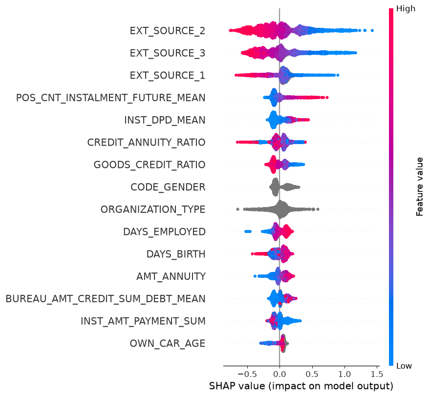

# Объяснимость: SHAP reason codes (Фаза 3)

TreeExplainer по прод-LightGBM. Глобальная важность — mean(|SHAP|); reason codes —
топ-факторы «за/против» по заявке (знак SHAP = направление влияния на риск).

## Глобальная важность (топ-15)
| # | Фича | mean(\|SHAP\|) |
|---|------|---------------|
| 1 | `EXT_SOURCE_2` | 0.2961 |
| 2 | `EXT_SOURCE_3` | 0.2652 |
| 3 | `EXT_SOURCE_1` | 0.1539 |
| 4 | `POS_CNT_INSTALMENT_FUTURE_MEAN` | 0.1116 |
| 5 | `INST_DPD_MEAN` | 0.0988 |
| 6 | `CREDIT_ANNUITY_RATIO` | 0.0965 |
| 7 | `GOODS_CREDIT_RATIO` | 0.0960 |
| 8 | `CODE_GENDER` | 0.0931 |
| 9 | `ORGANIZATION_TYPE` | 0.0838 |
| 10 | `DAYS_EMPLOYED` | 0.0811 |
| 11 | `DAYS_BIRTH` | 0.0794 |
| 12 | `AMT_ANNUITY` | 0.0773 |
| 13 | `BUREAU_AMT_CREDIT_SUM_DEBT_MEAN` | 0.0766 |
| 14 | `INST_AMT_PAYMENT_SUM` | 0.0753 |
| 15 | `OWN_CAR_AGE` | 0.0734 |

## Примеры reason codes

**Высокий риск (кандидат на отказ)** (PD = 1.000):

- `EXT_SOURCE_3` — внешний скоринговый балл 3 — повышает риск (SHAP +1.163)
- `EXT_SOURCE_2` — внешний скоринговый балл 2 — повышает риск (SHAP +1.091)
- `BUREAU_AMT_CREDIT_SUM_OVERDUE_SUM` — сумма AMT_CREDIT_SUM_OVERDUE: просроченная сумма — повышает риск (SHAP +0.687)
- `BUREAU_ACTIVE_COUNT` — число активных кредитов в бюро — повышает риск (SHAP +0.214)
- `BUREAU_AMT_CREDIT_SUM_DEBT_MEAN` — среднее AMT_CREDIT_SUM_DEBT: текущий долг по кредиту бюро — повышает риск (SHAP +0.153)
- `EXT_SOURCE_1` — внешний скоринговый балл 1 — повышает риск (SHAP +0.145)

**Низкий риск (кандидат на одобрение)** (PD = 0.000):

- `EXT_SOURCE_3` — внешний скоринговый балл 3 — снижает риск (SHAP −0.382)
- `EXT_SOURCE_2` — внешний скоринговый балл 2 — снижает риск (SHAP −0.372)
- `PREV_REFUSED_COUNT` — число отклонённых заявок — повышает риск (SHAP +0.187)
- `INST_PAYMENT_DIFF_SUM` — сумма PAYMENT_DIFF: недоплата = план − факт (derived) — снижает риск (SHAP −0.164)
- `INST_AMT_PAYMENT_SUM` — сумма AMT_PAYMENT: фактический платёж — снижает риск (SHAP −0.144)
- `POS_CNT_INSTALMENT_FUTURE_MEAN` — среднее CNT_INSTALMENT_FUTURE: оставшиеся платежи POS — снижает риск (SHAP −0.116)

